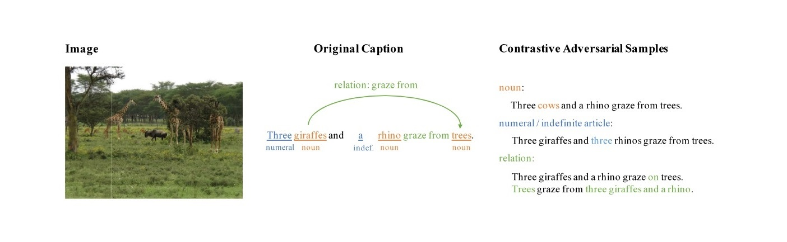

# VSE-C [(paper)](http://www.aclweb.org/anthology/C18-1315)

Developed by [Freda Shi](http://explorerfreda.github.io) and [Jiayuan Mao](http://vccy.xyz).


This repo includes the implementation of our paper "Learning Visually-Grounded Semantics from Contrastive Adversarial Samples" at COLING 2018. 



## Requirements
* Python3
* PyTorch 0.3.0
* NLTK
* spacy
* word2number
* TensorBoard
* NumPy
* [Jacinle](https://github.com/vacancy/Jacinle) (Jiayuan's personal toolbox, required by two evaluation experiments)

## VSE++
We apply [VSE++ (Faghri et al., 2017)](https://github.com/fartashf/vsepp) as our base model. 
To reproduce the baseline numbers of VSE++, please follow the instructions [here](https://github.com/fartashf/vsepp) by the authors. We found that their results are easy to reproduce!

## Datasets
We use the same datasets as [VSE++ (Faghri et al., 2017)](https://github.com/fartashf/vsepp).
Use the following commands to download the data of VSE to the root folder 
```bash
wget http://www.cs.toronto.edu/~faghri/vsepp/vocab.tar
wget http://www.cs.toronto.edu/~faghri/vsepp/data.tar
```
and unzip the tars with
```bash
tar -xvf vocab.tar
tar -xvf data.tar
```

You may also need [GloVe](https://nlp.stanford.edu/projects/glove/), as we apply [GloVe.840B.300d](http://nlp.stanford.edu/data/glove.840B.300d.zip) as the initialization of the word embeddings. We also provide a custom subset of GloVe embeddings at ``VSE_C/data/glove.pkl``.   

## Reproduce our Experiments

### Generate Contrastive Adversarial Samples 
The following commands generates specific types of contrastive adversarial samples of sentences. Note that the script will create folders in the initial data path, *e.g.*, ``../data/coco_precomp/noun_ex/``.
```bash
cd adversarial_attack
python3 $TYPE.py --data_path $DATA_PATH --data_name $DATA_NAME
``` 
``$TYPE`` can be one of ``noun``, ``numeral`` or ``relation``. Here is an example command:
```bash
python3 noun.py --data_path ../data --data_name coco_precomp
``` 

### Train VSE-C
Similar to VSE++, VSE-C supports training with contrastive adversarial samples in the text domain. After obtaining the contrastive adversarial samples, we can train an example noun-typed VSE-C with the following command (after generating noun-typed contrastive adversarial samples):
```bash
cd VSE_C
python3 train.py --data_path ../data/ --data_name coco_precomp \
    --logger_name runs/coco_noun --learning_rate 0.001 --text_encoder_type gru \
    --max_violation --worker 10 --img_dim 2048 --use_external_captions
```
The model will be saved into the logger folder, *e.g.*, ``runs/resnet152_noun``.
Please refer to ``VSE_C/train.py`` for more detailed description on hyper-parameters. Note that you also need to create

We have tested the model on GPU (CUDA 8.0). If you have any problem on training VSE-C on a different environment, please feel free to make an issue. 

### Evaluate VSE-C

#### In-Domain Evaluation
Here shows an example of the in-domain evaluation. Please run the code in Python3 or IPython3. 
```python
from VSE_C.vocab import Vocabulary
import VSE_C.evaluation
evaluation.eval_with_single_extended('runs/coco_noun', 'data/', 'coco_precomp', 'test')
```

#### Object Alignment
We provide our training script (testing is associated in the evaluation procedure) at ``evaluation/object_alignment``. Please refer to the script for detailed usage. 

#### Saliency Visualization (Jacinle required)
``evaluation/saliency_visualization/saliency_visualization.py`` provides the script for saliency visualization. Please refer to the script for detailed usage. The visualized saliency images will be like:

 

#### Sentence Completion (Fill-in-the-Blanks, Jacinle required)
First, we need to generate datasets for sentence completion by 
```bash
cd evaluations/completion
python3 completion_datamaker.py --input $INPUT_PATH --output $OUTPUT_PATH
```
Then, run
```bash
python3 -m evaluations.completion.completion_train $ARGS
python3 -m evaluations.completion.completion_test $ARGS
```
for training and testing sentence completion models. 
Please refer to evaluation scripts for further descriptions of arguments.

## Reference
If you find VSE-C useful, please consider citing:
``` 
@inproceedings{shi2018learning,
    title={Learning Visually-Grounded Semantics from Contrastive Adversarial Samples},
    author={Shi, Haoyue and Mao, Jiayuan and Xiao, Tete and Jiang, Yuning and Sun, Jian},
    booktitle={Proceedings of the 27th International Conference on Computational Linguistics},
    year={2018}
}
```

## License
[MIT](LICENSE)
